# TrustLens

**Real-time deepfake detection for video-call KYC onboarding.**
TrustLens watches the caller during a video call and, within a few seconds, shows the agent **plain-English reasons** why the caller may be a deepfake. It works on **short clips (about 3 seconds)** of a **person it has never seen before**.

> Diagrams in this file use [Mermaid](https://mermaid.js.org/). They render on GitHub, GitLab, VS Code (Markdown Preview Mermaid Support) and most Markdown viewers.

---

## Table of Contents

1. [Project status (read this first)](#1-project-status-read-this-first)
2. [The problem](#2-the-problem)
3. [The idea in one picture](#3-the-idea-in-one-picture)
4. [System architecture](#4-system-architecture)
5. [Live call flow, step by step](#5-live-call-flow-step-by-step)
6. [The light challenge](#6-the-light-challenge)
7. [Backend pipeline](#7-backend-pipeline)
8. [Evidence channels (the AI parts)](#8-evidence-channels-the-ai-parts)
9. [Fusion and decision](#9-fusion-and-decision)
10. [Explanations](#10-explanations)
11. [Frontend](#11-frontend)
12. [API contract](#12-api-contract)
13. [Training pipeline](#13-training-pipeline)
14. [Evaluation](#14-evaluation)
15. [Running on a CPU-only 8 GB laptop](#15-running-on-a-cpu-only-8-gb-laptop)
16. [Threat model](#16-threat-model)
17. [Privacy and consent](#17-privacy-and-consent)
18. [Repository layout](#18-repository-layout)
19. [Quick start](#19-quick-start)
20. [Configuration](#20-configuration)
21. [24-hour build plan](#21-24-hour-build-plan)
22. [Limits (honest)](#22-limits-honest)
23. [Glossary](#23-glossary)
24. [References](#24-references)

---

## 1. Project status (read this first)

| Part | Status | Notes |
|---|---|---|
| Frontend v0.1 (`trustlens-ui`) | **Built** | Vite + React + Tailwind v4. Simulated call, built-in mock engine, right-side analysis panel. Production build passes. Not yet tested in a real browser by the author. |
| Frontend: live two-person call + caller page | **Specified** | PeerJS call, flash overlay, phrase card. See Stage 7 in the Prompt Pack. |
| Backend (FastAPI) | **Specified** | Full design and generation prompts in `TrustLens_Backend_AI_Prompt_Pack.md`. |
| AI models (EdgeNet, CLIP, WavLM head, fusion) | **Specified** | Training plan for Kaggle/Colab. Stubs are used until real weights exist. |
| Benchmark (TrustLens-Bench) | **Planned** | Needs consented team recordings. |

Everything below describes the **target design**. Where something is not built yet, it is marked **(planned)**.

---

## 2. The problem

In video KYC, a person shows their face on camera. Fraudsters now use two kinds of attack:

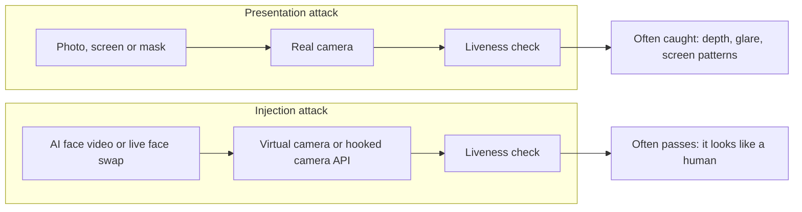

- **Presentation attack:** something fake is held in front of a real camera. Old liveness checks catch many of these.
- **Injection attack:** the real camera is skipped. A synthetic video is pushed straight into the app. It can blink and smile on command, so it **passes normal liveness checks**.
- **Hard limits:** we only get a **short clip**, and we have **no earlier video** of the real person to compare with.

---

## 3. The idea in one picture

Most tools ask: *"Does this video look real?"*
TrustLens asks **four questions** and combines the answers.

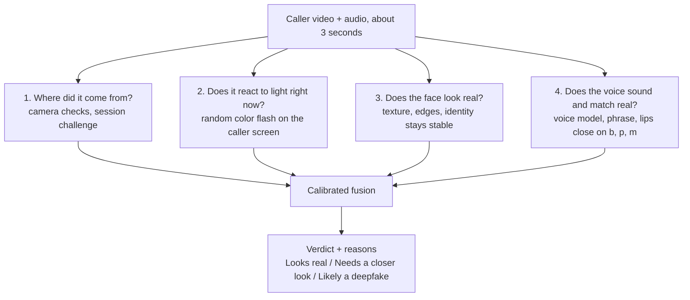

**Why layers?** Any single check can fail. A pre-made deepfake cannot answer a random light test. A live face swap may pass the light test but often breaks on lip closure, identity stability, or voice. Layers cover each other.

---

## 4. System architecture

Two devices join a call. The agent laptop runs the UI, the backend, and (optionally) a small local language model.

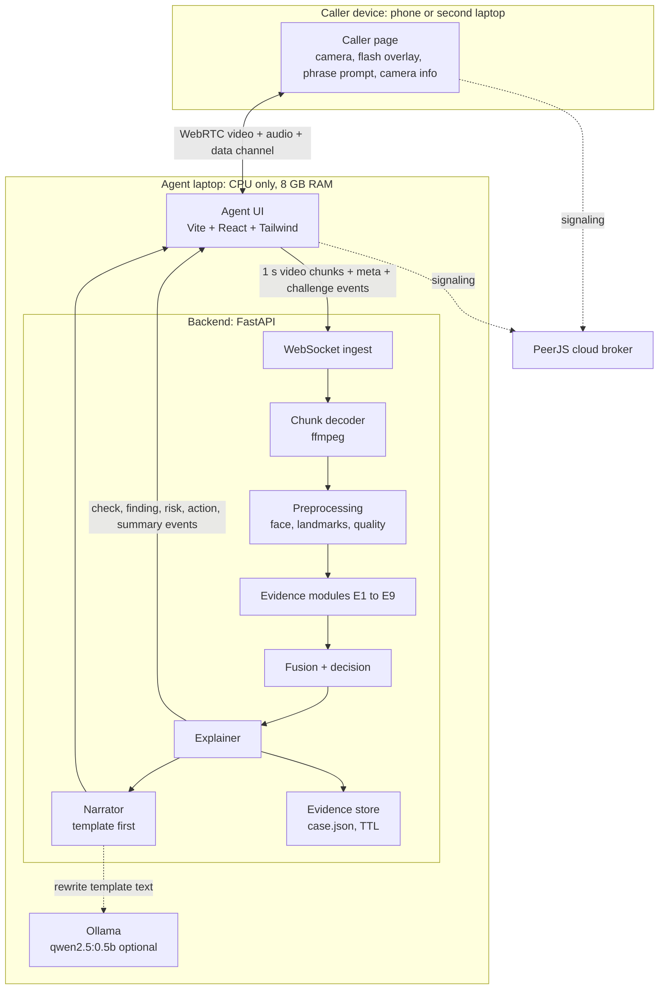

**Tap point:** by default the **agent's browser** records the **received** stream and sends it to the backend (`TAP=agent`). A switch `TAP=caller` lets the caller page send its own camera instead. It gives a cleaner signal (no WebRTC re-compression, real camera info, correct flash timing).

---

## 5. Live call flow, step by step

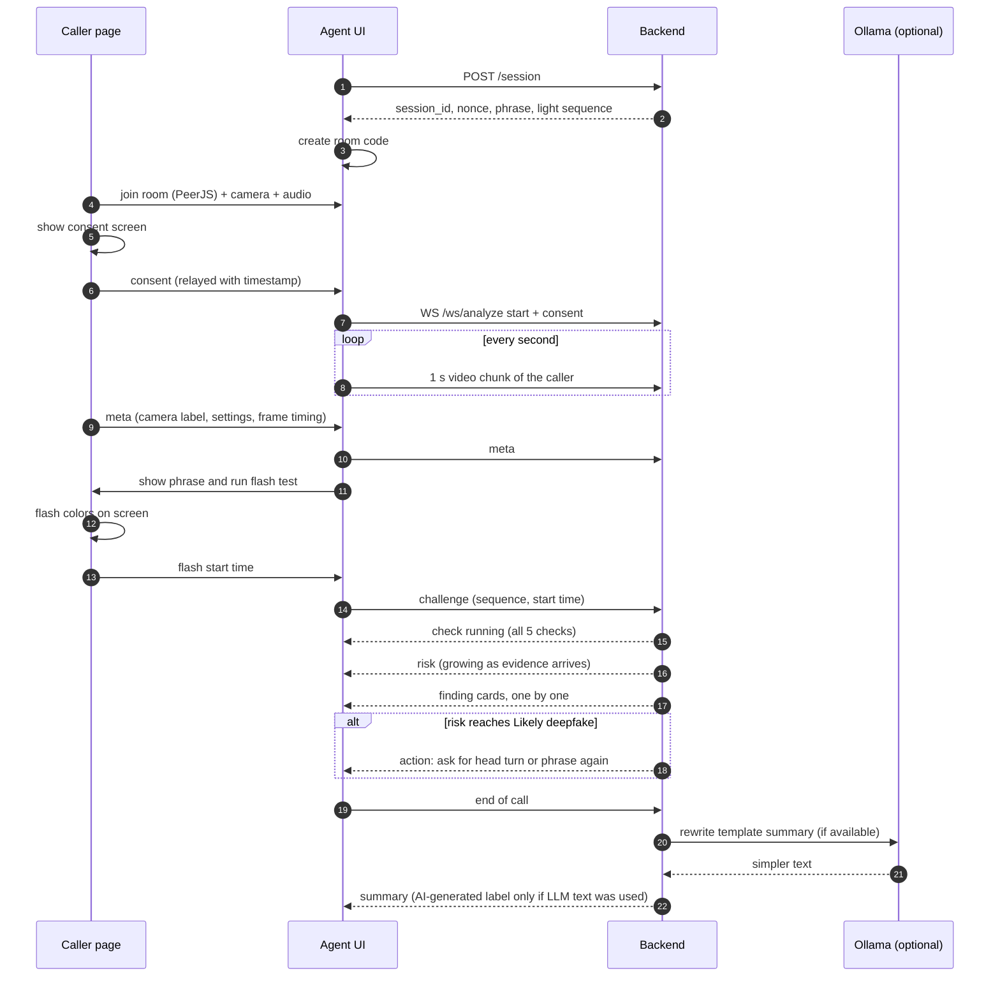

---

## 6. The light challenge

The strongest cheap signal. The caller's screen shows a **random color sequence**. A real face in front of the screen reflects a little of that light **right now**. A pre-made fake video cannot know the colors.

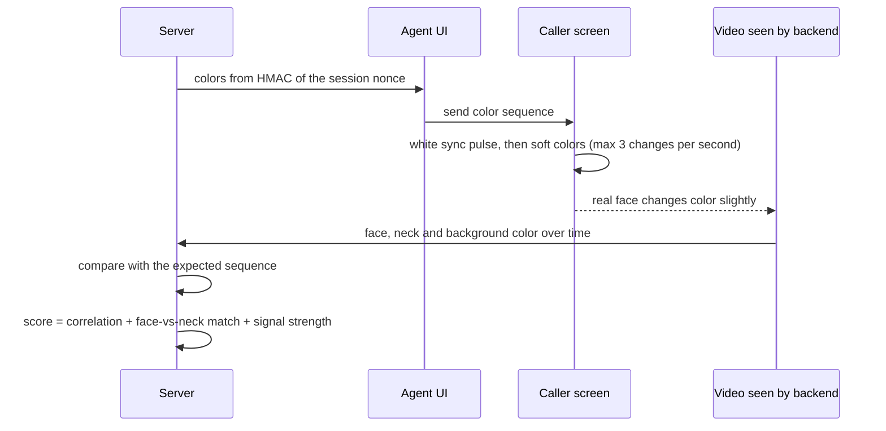

What the backend measures:

| Feature | Meaning | Why it helps |
|---|---|---|
| `corr_face` | How well face color follows the sequence | Pre-made fakes do not follow it |
| `neck_face_corr` and `neck_face_ratio` | Do face and neck react the same way? | In a face swap, the swapped face and the real neck can react differently |
| `snr` | Signal strength | Low light lowers trust in this check |
| `lag_ms` | Delay of the reaction | **Not used as evidence with `TAP=agent`** because network delay changes it |

**Timing fix:** the backend aligns on the **white sync pulse seen in the video itself**, so network delay does not break the check.

**Safety:** at most 3 color changes per second, soft colors, a warning, and a Skip button (photosensitivity).

**Honest limit:** a fast attacker who re-lights the fake in real time can weaken this check. That is why other layers exist.

---

## 7. Backend pipeline

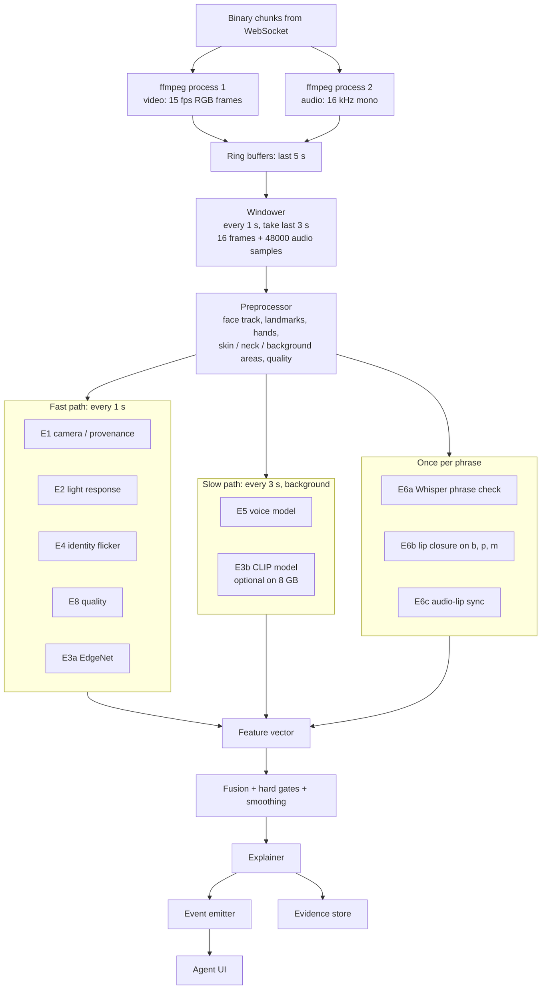

**Key rules:**

- **Persistent decoder:** the browser recorder sends fragments. Only the first one has the header. All fragments must go **in order into one ffmpeg process**. (Fallback `CLIP_MODE`: the UI sends complete 3 s clips.)
- **Latest wins:** if processing falls behind, old windows are dropped. No endless queue.
- **Missing data is allowed:** no audio means the `voice` and `lips` checks show "unsure", and weight moves to other channels. No crash.
- **One heavy job at a time** on the 8 GB laptop.

### Streaming windows

```mermaid
gantt
  title Sliding 3-second windows, one result per second
  dateFormat HH:mm:ss
  axisFormat %S s
  section Video stream
  Incoming video            :00:00:00, 8s
  section Windows
  Window 1 (0 to 3 s)       :00:00:00, 3s
  Window 2 (1 to 4 s)       :00:00:01, 3s
  Window 3 (2 to 5 s)       :00:00:02, 3s
  Window 4 (3 to 6 s)       :00:00:03, 3s
  Window 5 (4 to 7 s)       :00:00:04, 3s
```

---

## 8. Evidence channels (the AI parts)

| ID | Name | How it works | Trained? | UI check |
|---|---|---|---|---|
| E1 | Camera / provenance | Virtual-camera names, odd settings, too-smooth frame timing, session nonce | No | Camera source |
| E2 | Light response | Face vs neck vs background color against the random sequence | No | Reaction to light |
| E3a | EdgeNet | MobileNetV3-Small + frequency branch + GRU on 16 face crops | Yes | Face texture |
| E3b | CLIP-LN + SBI | OpenCLIP, only LayerNorm + head trained, self-blended fake training | Yes | Face texture |
| E4 | Identity flicker | Face embedding stays stable across frames, landmark jitter | No | Face texture |
| E5 | Voice-clone detector | Frozen WavLM + small head, 1 s window scores | Yes | Voice |
| E6a | Phrase check | Whisper tiny with word times vs the random phrase | No | Lips match sound |
| E6b | Lip closure | Mouth must close at b, p, m sounds | No | Lips match sound |
| E6c | Audio-lip sync | Cheap cross-correlation (SyncNet only on strong hardware) | No | Lips match sound |
| E7 | rPPG pulse | Skin color pulse, **info only, weight 0** | No | none |
| E8 | Quality | Blur, light, face size, frame drops | No | none (changes trust) |
| E9 | Novelty | Distance from real-face examples | Light | Face texture |

**Why the "b, p, m" trick:** these sounds need the lips to close. Generated mouths often stay open. The random phrase uses words that start with them (for example "Paper", "Mountain", "Bottle").

**Why self-blended images (SBI):** the model trains on **real faces blended with slightly changed copies of themselves**. It learns blending traces instead of one specific fake generator. This helps on unseen fake types.

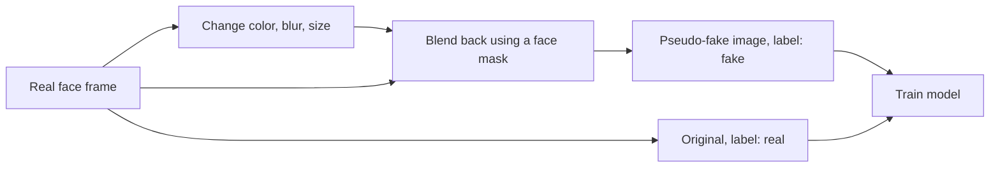

---

## 9. Fusion and decision

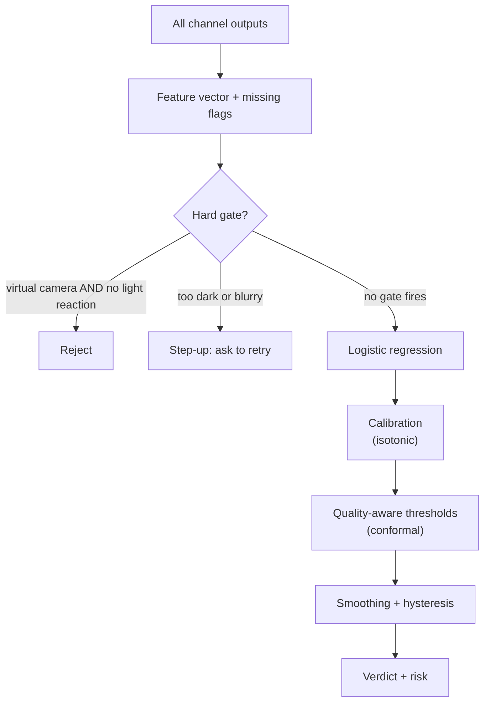

**Verdict bands (used by the UI):**

| Risk | Verdict |
|---|---|
| below 0.35 | **Looks real** |
| 0.35 to 0.70 | **Needs a closer look** |
| 0.70 or more | **Likely a deepfake** |

**Hysteresis** stops the badge from flickering:

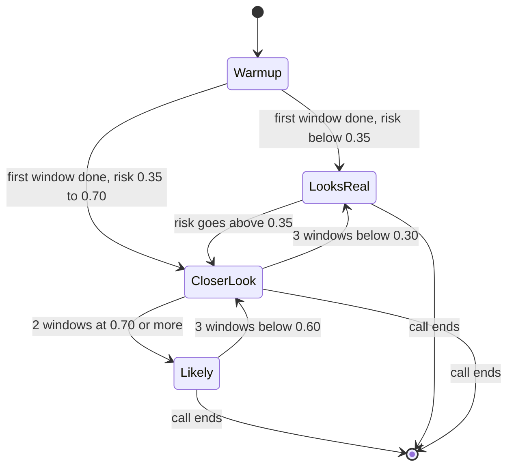

(Numbers are starting values. Tune them on real recordings.)

**Calibration and thresholds:** thresholds are chosen so that **real users are wrongly rejected at most about 2% of the time**, **per quality level**. This protects people with bad webcams. The guarantee assumes test data looks like calibration data, so new cameras can break it.

**On "Likely a deepfake":** the UI shows a red banner and an **action card** ("Ask the caller to turn their head left, then say the phrase again"). **The call is never ended automatically.** A human decides.

---

## 10. Explanations

TrustLens must say **why**. Each explanation type is labeled by how trustworthy it is.

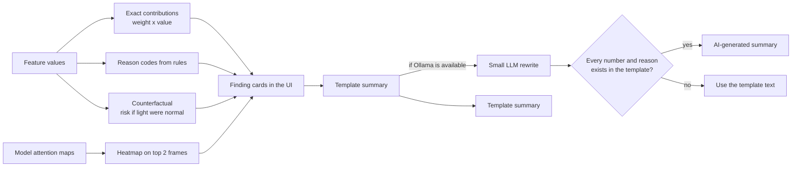

| Explanation | Trust level |
|---|---|
| Exact contributions, counterfactuals, reason codes, light and audio charts | **Faithful** (computed from the real features) |
| Heatmaps (Grad-CAM or attention) | **Illustrative** (shows where the model looked, not proof) |
| LLM summary | **Wording only**. It can never change a score or decision |

### Finding cards (what the agent sees)

| Code | UI check | Title (plain English) | Severity |
|---|---|---|---|
| `VIRTUAL_CAMERA` | Camera source | Video may not come from a real camera | high |
| `NO_LIGHT_REACTION` | Reaction to light | Face did not react to screen light | high |
| `NECK_FACE_MISMATCH` | Reaction to light | Face and neck react differently to light | medium |
| `TEXTURE_BLEND` | Face texture | Face edges or skin look artificial | medium or high |
| `IDENTITY_FLICKER` | Face texture | Face identity changes between frames | medium |
| `OCCLUSION_ARTIFACT` | Face texture | Face breaks when covered | medium |
| `VOICE_SYNTHETIC` | Voice | Voice may be computer-made | medium |
| `LIP_CLOSURE_MISSING` | Lips match sound | Mouth does not match the sound | medium |
| `SYNC_OFFSET` | Lips match sound | Sound and lips are out of step | medium |
| `PHRASE_MISMATCH` | Lips match sound | They did not say the requested words | high |
| `UNKNOWN_PATTERN` | Face texture | Unusual video that we cannot judge | low |

---

## 11. Frontend

**Stack:** Vite, React, Tailwind CSS v4, JavaScript.

### Screens

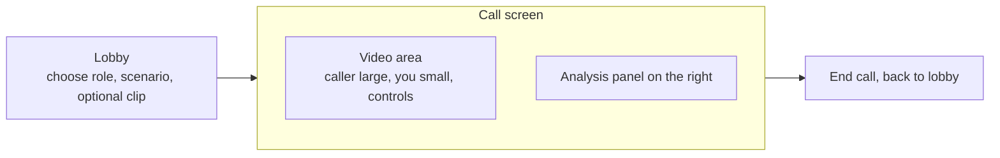

### Component tree

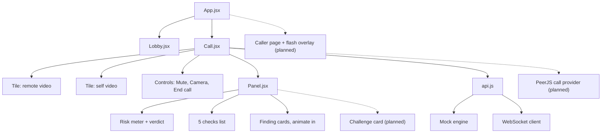

### What the agent sees

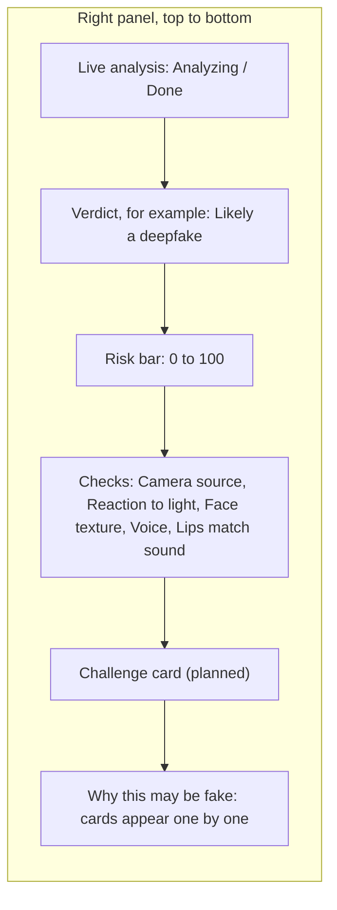

Design choices: calm light panel with a dark video stage, one accent color for good, amber and red only for warnings, plain sentence-case words, visible keyboard focus, reduced-motion support.

---

## 12. API contract

### WebSocket `/ws/analyze` (agent to backend)

| Direction | Message | Purpose |
|---|---|---|
| Client to server | JSON `start` with `consent` and optional `session_id` | Open a session. Rejected if consent is missing (see section 17) |
| Client to server | Binary chunks, 1 s each, `video/webm` | The caller's video + audio |
| Client to server | JSON `meta` (camera label, settings, frame intervals) | Camera / provenance info |
| Client to server | JSON `challenge` (`light` with sequence and start time, `phrase` with expected text) | Challenge timing |
| Client to server | JSON `clock` ping | Estimate clock offsets |
| Server to client | `check` `{id, state}` | `id` is `source`, `light`, `face`, `voice`, `lips`. `state` is `running`, `ok`, `warn`, `bad` |
| Server to client | `finding` `{id, severity, title, detail, t}` | A reason card |
| Server to client | `risk` `{value}` | 0 to 1 |
| Server to client | `action` `{kind, message, challenge}` | Suggested next step on "likely" (optional) |
| Server to client | `summary` `{text, ai_generated}` | End-of-call summary (optional) |
| Server to client | `evidence` `{kind, url, data}` | Heatmap or timeline (optional) |
| Server to client | `error` `{code}` | For example `CONSENT_REQUIRED` |

### Event order (typical fake caller)

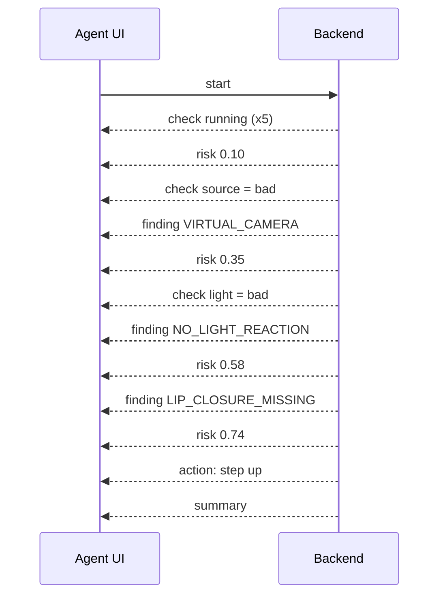

### REST

| Method | Path | Purpose |
|---|---|---|
| POST | `/session` | New session: nonce, phrase, light sequence, expiry |
| POST | `/analyze/file` | Upload a video (max 50 MB) + optional sidecar JSON. Same pipeline as live. Returns events + final result |
| GET | `/cases/{session_id}` | Saved evidence JSON (if retention is on) |
| GET | `/health` | Models loaded, ffmpeg present |
| GET | `/metrics` | Latency per stage, dropped windows, RAM, `stubs_in_use` |

---

## 13. Training pipeline

Training happens in **Kaggle or Colab notebooks**, separate from serving. Output is a `models/` folder the backend loads.

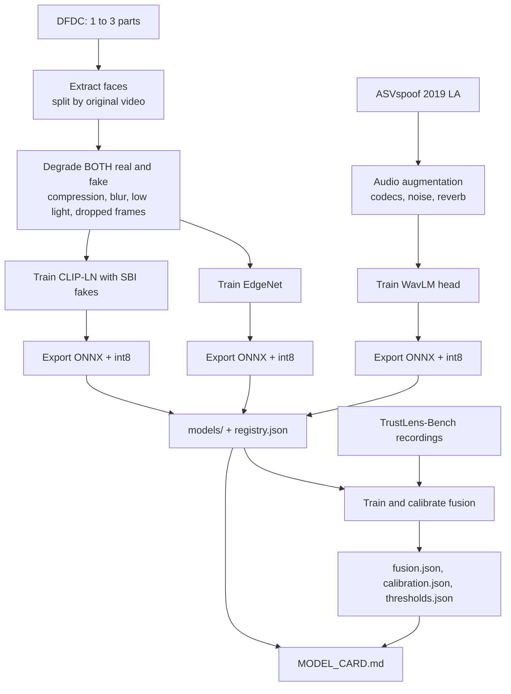

**Rules that must hold:**

1. **Split by source video** (DFDC `original` field), so no person appears in both train and test.
2. **Degrade both classes** so the model learns "bad webcam is not fake".
3. **Parity test** for every ONNX export (difference from PyTorch below 1e-3) and report the accuracy change after int8.
4. **Stubs never pose as real models** (labeled `stub-0`, and no accuracy is reported while stubs are loaded).

### How the fusion model is trained (honest version)

No single dataset has all channels. So:

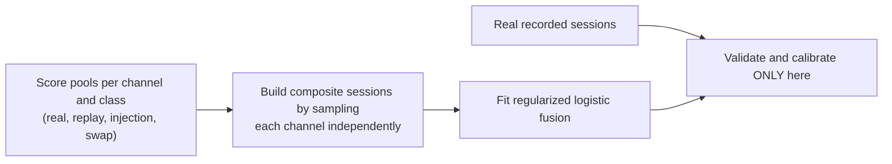

**Assumption to state in every report:** channels are roughly independent given the class. Validation uses **real recorded sessions only**, never composites.

---

## 14. Evaluation

Modeled after the **CEN/TS 18099** idea: test **attacks** and also **real users** (false rejections).

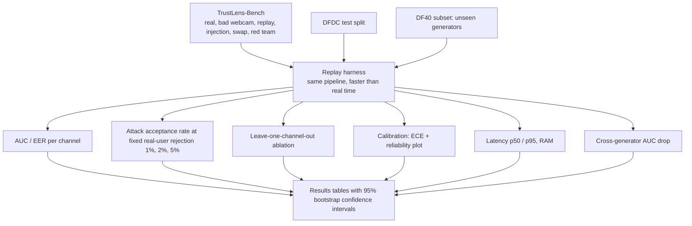

| Test | What it proves |
|---|---|
| Per-channel AUC / EER on 3-second windows | Each module works alone on short clips |
| Compression sweep (clean, medium, heavy) | Works on real webcams |
| Cross-generator (train DFDC + SBI, test DF40 subset) | Generalization to unseen fake types |
| Attack acceptance by level L0 to L4 | The main security number |
| Real-user rejection and step-up rate (good vs bad webcam) | Fair to real users |
| Leave-one-channel-out ablation | Every layer matters |
| Calibration (ECE) | Scores can be trusted |
| Latency and RAM | Fits a CPU laptop |

Synthetic clips made for testing check **plumbing only**. They are labeled `source=synthetic` and never produce accuracy numbers.

---

## 15. Running on a CPU-only 8 GB laptop

The demo laptop holds the OS, Chrome with a live call, the backend, models, and optionally Ollama.

| Item | Rule | Rough RAM (measure it!) |
|---|---|---|
| OS + Chrome with a live call | Leave free | 3.0 to 3.5 GB |
| EdgeNet int8 | Always loaded | under 0.1 GB |
| MediaPipe | Always loaded | about 0.2 GB |
| WavLM head int8 | Run every 3 s | 0.2 to 0.5 GB |
| Whisper tiny int8 | Load when needed, unload after | about 0.15 GB |
| CLIP ViT-B/32 int8 | **Off by default.** Turn on only if free RAM is above 1.5 GB | 0.2 to 0.4 GB |
| ffmpeg (2 processes) | Per session | about 0.2 GB |
| Ollama `qwen2.5:0.5b` | Only after the call ends, `keep_alive` 5 minutes | 0.5 to 0.8 GB |

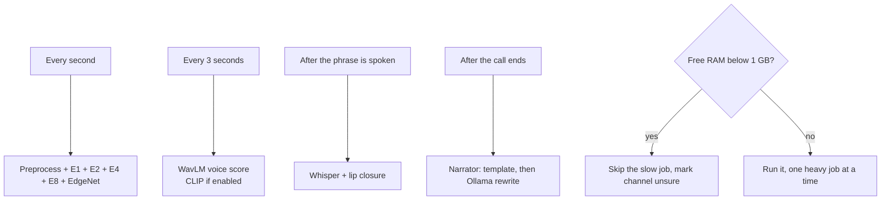

**Targets (measure and report, do not assume):** first check update within 1 s, first finding within 5 s, fast path per window p95 within 1.5 s on CPU.

---

## 16. Threat model

| Level | Attacker | Example | Our defense | Honest rating |
|---|---|---|---|---|
| L0 | Presentation | Photo or screen in front of the camera | Light check, quality, phrase | Strong |
| L1 | Cheap injection | Pre-recorded deepfake through a virtual camera | Light check, phrase, camera flags | Strong |
| L2 | Real-time swap | Live person + face-swap tool | Neck-vs-face light, identity flicker, lip closure, models | Medium to strong (test it) |
| L3 | L2 + voice | Voice conversion or TTS | Voice model, phrase, lip closure | Medium |
| L4 | Adaptive | Attacker re-lights the fake to match our flash | Multiple layers, short random timing | Raises cost, not guaranteed |
| L5 | Device compromise | Hooked camera API, emulator, rooted phone | **Needs native device attestation** | **Not solved in a web demo** |

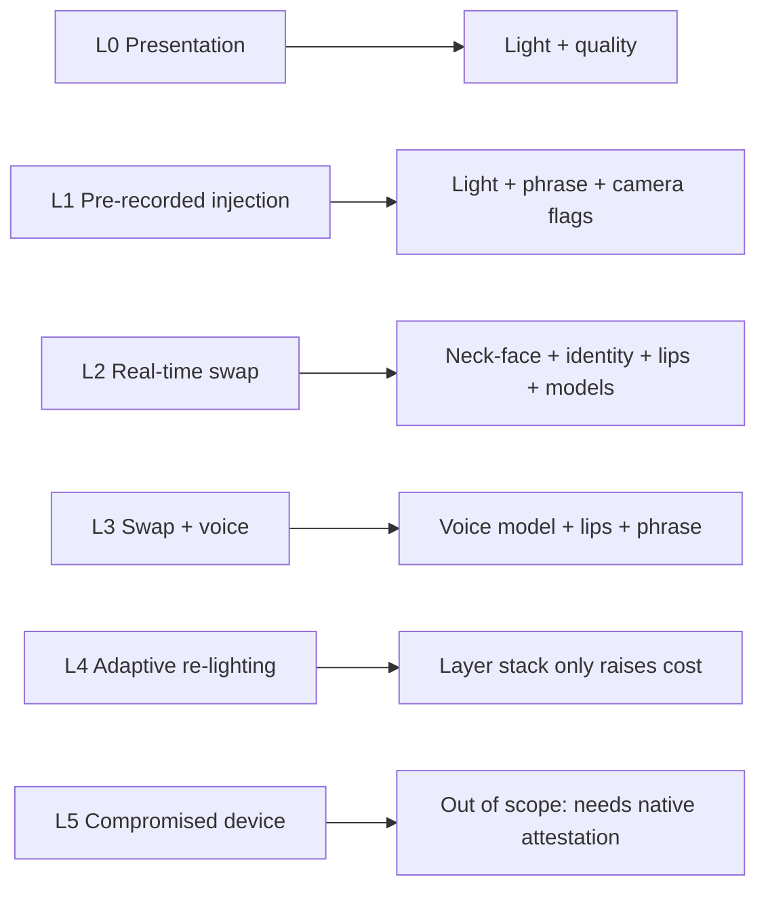

---

## 17. Privacy and consent

```mermaid
flowchart TB
  START["Caller opens the caller page"] --> CONS["Consent screen<br/>explains video and voice analysis,<br/>no raw video stored"]
  CONS -->|"accepts"| SEND["Consent relayed with a timestamp"]
  CONS -->|"declines"| STOP["No analysis"]
  SEND --> WS["Backend start message"]
  WS --> CH{"consent present and true?"}
  CH -->|"no"| ERR["Error CONSENT_REQUIRED, close socket 4403"]
  CH -->|"no, but ENV=demo and DEMO_BYPASS_CONSENT=true"| WARN["Allowed, warning logged, case marked bypassed"]
  CH -->|"yes"| RUN["Analysis runs in memory"]
  RUN --> END["Call ends"]
  END --> DEL["Delete buffers, kill ffmpeg"]
  END --> KEEP["Save only features, findings, hashes (case.json, deleted after TTL)"]
```

- **Consent comes from the caller**, the person being analyzed.
- **No raw video or audio is stored by default** (`KEEP_RAW=false`). The optional "Save session for benchmark" button is for **consenting team members only**.
- **The summary model runs locally** (Ollama). No evidence is sent to an outside API.
- Test for **bias** across skin tones, ages, glasses, lighting, and webcams. Report even a small check.
- Check local rules for video KYC (for example RBI V-CIP in India, FinCEN and BSA in the US, GDPR in the EU). **Verify exact clauses before stating them.**

---

## 18. Repository layout

```text
repo/
├── frontend/ (or trustlens-ui/)       # Vite + React + Tailwind v4
│   ├── src/
│   │   ├── App.jsx  Lobby.jsx  Call.jsx  Panel.jsx
│   │   ├── api.js                     # config, mock engine, backend client
│   │   └── (planned) CallerPage.jsx  FlashOverlay.jsx  ChallengeCard.jsx  peer.js
│   ├── .env.example
│   └── package.json
├── backend/                           # FastAPI (planned)
│   ├── app/
│   │   ├── main.py  config.py  schemas.py  session.py  ws.py
│   │   ├── decoder.py  windower.py  preprocess.py  runtime.py
│   │   ├── fusion.py  explain.py  narrator.py  store.py  metrics.py  mock.py
│   │   └── signals/  provenance.py  light.py  identity.py  quality.py
│   │                 phrase.py  lip_closure.py  sync.py  rppg.py  thresholds.py
│   ├── models/                        # onnx files, registry.json, fusion/calibration/thresholds json
│   ├── ml/                            # training notebooks and scripts (Kaggle/Colab)
│   ├── bench/                         # replay.py, metrics.py, manifest.csv, plots.py
│   ├── scripts/                       # make_test_clips.py, stream_file.py
│   └── tests/
├── docker-compose.yml
├── TrustLens_Backend_AI_Prompt_Pack.md   # prompts to generate backend + AI
├── TrustLens_v2_Deep_Solution_Report.md  # research and design report
└── README.md                             # this file
```

---

## 19. Quick start

### Frontend (works today, with the built-in mock engine)

```bash
cd trustlens-ui        # or frontend/
npm install
cp .env.example .env   # VITE_USE_MOCK=true
npm run dev
```

Open the URL Vite prints, allow camera and microphone, choose **A deepfake** or **A real person**, and press **Start video call**. After a few seconds the reasons appear on the right.

### Connect a real backend (when it exists)

1. In `.env` set `VITE_USE_MOCK=false`, `VITE_API_URL=http://localhost:8000`, `VITE_WS_URL=ws://localhost:8000`.
2. Start the backend (planned commands, check the generated README):

```bash
cd backend
python -m venv .venv && source .venv/bin/activate
pip install -r requirements.txt
# ffmpeg must be installed on the system
uvicorn app.main:app --host 0.0.0.0 --port 8000
```

3. Optional local summary model:

```bash
ollama pull qwen2.5:0.5b
ollama list            # check it is there
```

### Two-device live call (planned)

- Put both devices on the **same Wi-Fi or a phone hotspot**.
- The caller phone needs **HTTPS** for the camera. Use a tunnel (Cloudflare Tunnel, ngrok) or mkcert.
- PeerJS uses the public broker by default. Backup: `npx peerjs --port 9000` and point both devices to the laptop IP.
- Keep the **clip backup** (rehearsal mode) ready in case the network fails.

---

## 20. Configuration

### Frontend (`.env`)

| Variable | Default | Meaning |
|---|---|---|
| `VITE_USE_MOCK` | `true` | Use the built-in mock engine |
| `VITE_API_URL` | `http://localhost:8000` | REST base URL |
| `VITE_WS_URL` | `ws://localhost:8000` | WebSocket base URL |
| `VITE_TAP` (planned) | `agent` | `agent` or `caller` |
| `VITE_PEER_HOST/PORT/PATH` (planned) | public broker | PeerJS server settings |

### Backend (planned)

| Variable | Default | Meaning |
|---|---|---|
| `ALLOWED_ORIGINS` | `http://localhost:5173` | CORS and origin check |
| `API_TOKEN` | empty (off) | Optional bearer token |
| `SECRET_KEY` | none | Used for the light-sequence HMAC |
| `USE_MOCK` | `false` | Scripted events, no AI |
| `CLIP_MODE` | `false` | Expect complete 3 s clips |
| `TAP` | `agent` | Where the video comes from |
| `FPS` / `WINDOW_SEC` / `STRIDE_SEC` | 15 / 3 / 1 | Windowing |
| `MEMORY_PROFILE` | `8gb` | Model loading rules |
| `DEVICE` | `cpu` | Inference device |
| `ORT_THREADS` | `4` | ONNX threads |
| `NARRATOR_MODE` | `auto` | `auto`, `template`, `llm` |
| `OLLAMA_URL` / `OLLAMA_MODEL` | `http://localhost:11434` / `qwen2.5:0.5b` | Local LLM |
| `KEEP_RAW` | `false` | Store raw media (keep off) |
| `CASE_TTL_HOURS` | `24` | Delete saved cases after this |
| `ENV` / `DEMO_BYPASS_CONSENT` | `prod` / `false` | Consent bypass only in demo |

---

## 21. 24-hour build plan

```mermaid
gantt
  title Build plan with 4 people
  dateFormat YYYY-MM-DD HH:mm
  axisFormat %Hh
  section P1 Vision ML
  Face extraction and EdgeNet           :a1, 2026-01-01 00:00, 8h
  SBI and CLIP model                    :a2, after a1, 6h
  Cross-generator test and heatmaps     :a3, after a2, 4h
  section P2 Audio and lips
  Whisper phrase and lip closure        :b1, 2026-01-01 01:00, 6h
  WavLM head and timeline               :b2, after b1, 8h
  Audio evaluation                      :b3, after b2, 3h
  section P3 Signals and fusion
  Light response and quality            :c1, 2026-01-01 01:00, 7h
  Identity flicker and fusion v1        :c2, after c1, 5h
  Bench recording and calibration       :c3, after c2, 5h
  Ablation and result tables            :c4, after c3, 3h
  section P4 Web and demo
  Mock backend and live call UI         :d1, 2026-01-01 00:00, 8h
  Backend integration and attack lab    :d2, after d1, 8h
  Narrator, rehearsal, backup videos    :d3, after d2, 5h
  section Gates
  Code freeze                           :milestone, 2026-01-01 23:00, 0h
```

### Roles

| Person | Owns |
|---|---|
| P1 Vision ML | Face extraction, EdgeNet, CLIP-LN + SBI, heatmaps |
| P2 Audio + lips | Voice head, Whisper phrase, lip closure, audio timeline |
| P3 Signals + fusion + eval | Light response, identity, quality, fusion, calibration, benchmark tables |
| P4 Web + integration + demo | Frontend, backend API, live call, narrator, pitch |

### Tiers and cut order

| Tier | Items |
|---|---|
| **Core (must work)** | Mock backend, decoder, light check, phrase + lip closure, quality, rule-based fusion, analysis panel, honest results table |
| **Advanced** | CLIP-LN + SBI, WavLM head, identity flicker, calibrated fusion, local-LLM summary, TrustLens-Bench |
| **Stretch** | ASR vs lip-reading, novelty score, rPPG, small light model, frame hash chain |

**Cut in this order if time runs out:** lip-reading consistency, novelty score, rPPG, light model, chat copilot, CLIP model, conformal thresholds.
**Never cut:** light check, phrase + lip closure, plain-English findings, analysis panel, honest results.

---

## 22. Limits (honest)

- **Compromised devices (L5)** are not solved in a browser. Real products need native attestation (Play Integrity / App Attest) and a secure SDK.
- A **fast adaptive attacker** who re-lights the fake in real time can weaken the light check.
- **New fake generators** can still fool the models. We measure the drop on unseen generators and report it.
- With the **agent-side tap**, the video is already re-compressed and delayed. Camera clues are weaker and absolute light timing is not used. `TAP=caller` is better.
- **3 seconds is short.** Pulse (rPPG) is information only.
- The **demo benchmark is small**, so results carry wide confidence intervals.
- The **small summary model can make mistakes**, so it only rewrites a fixed template and its output is checked.
- **Photosensitivity:** flashing is limited and skippable. Some users should not use it.
- RAM numbers in this file are **estimates**. Measure them.

---

## 23. Glossary

| Term | Simple meaning |
|---|---|
| **KYC** | Know Your Customer: checking who a new customer really is |
| **Liveness** | Checking a real, present person is on camera |
| **Presentation attack** | Showing a fake (photo, screen, mask) to a real camera |
| **Injection attack** | Feeding fake video straight into the app, skipping the camera |
| **Virtual camera** | Software that pretends to be a webcam (for example OBS) |
| **Face swap** | AI puts one person's face on another's moving head |
| **DFDC** | Meta's DeepFake Detection Challenge dataset |
| **SBI** | Self-Blended Images: fake training examples made from real faces |
| **CLIP** | A large vision model; we tune only a few of its parameters |
| **WavLM** | A speech model used to spot cloned voices |
| **ONNX** | A portable model file that runs fast on CPU |
| **int8** | Smaller, faster number format for models |
| **WebRTC** | Browser technology for live video calls |
| **PeerJS** | A library that makes WebRTC calls easy |
| **ffmpeg** | Tool that decodes video and audio |
| **EER / AUC** | Error rate where false accept equals false reject / overall ranking quality |
| **ECE** | How well predicted risk matches real frequency (calibration) |
| **Conformal** | A method to set thresholds with a target error rate |
| **Hysteresis** | Needing several windows in a row to change the verdict, to avoid flicker |
| **rPPG** | Pulse estimated from tiny skin color changes |
| **CEN/TS 18099** | A standard for testing injection attack detection |

---

## 24. References

Open and verify these before quoting. Vendor blogs are marketing, so use them for context only.

**Standards and policy**
- CEN/TS 18099 overview: https://withpersona.com/blog/what-is-cen-ts-18099-a-guide-to-the-injection-attack-detection-standard
- Standard note (includes real-user testing): https://idtechwire.com/new-standard-introduced-for-assessing-biometric-injection-attacks
- ISO 25456 "under development" mention (vendor): https://www.iproov.com/?p=18584
- FinCEN FIN-2024-Alert004: https://www.fincen.gov/sites/default/files/shared/FinCEN-Alert-DeepFakes-Alert508FINAL.pdf

**Attacks and liveness**
- Face Flashing (NDSS 2018): https://arxiv.org/pdf/1801.01949
- MITRE ATLAS / iProov injection scenario: https://www.mobileidworld.com/mitre-atlas-adds-iproov-camera-injection-scenario-targeting-mobile-kyc/
- Why liveness fails against injection (vendor): https://www.signzy.com/blogs/liveness-detection-bypass-deepfake-injection
- Injection and attestation (vendor): https://joinble.io/en/blog/injection-attacks-liveness-detection-kyc

**Detection research**
- Zero-shot audio-visual consistency: https://arxiv.org/abs/2406.07854
- SAVe, self-supervised audio-visual detection: https://sotaverified.org/papers/260325140
- DF40 benchmark: https://ar5iv.labs.arxiv.org/html/2406.13495 (code: https://github.com/YZY-stack/DF40)
- CLIP with LayerNorm tuning: https://arxiv.org/html/2503.19683v2 and https://arxiv.org/html/2508.06248v1
- ASVspoof 5 systems: https://arxiv.org/pdf/2408.09933 , https://arxiv.org/pdf/2408.11152
- rPPG and compression: https://arxiv.org/pdf/2111.07601
- Dataset: https://ai.meta.com/datasets/dfdc/

**Project documents**
- `TrustLens_v2_Deep_Solution_Report.md`: research, design, evaluation plan
- `TrustLens_Backend_AI_Prompt_Pack.md`: backend and AI prompts, decisions, questions