# TrustLens

**Real-time, multi-agent deepfake detection for video-call KYC.**

TrustLens watches the caller during a live video call and, within a few seconds, shows the human agent **plain-English reasons** why the caller might be a deepfake. It works on **short clips (about 3 seconds)** of a **person it has never seen before**.

Instead of one big "real or fake?" model, TrustLens runs a team of small specialist **agents**. Each agent checks one thing (where the video came from, the voice, the face pixels, the face shape, the lips). A fusion layer combines their answers into one calibrated verdict. **A human always makes the final decision.**

> Diagrams use [Mermaid](https://mermaid.js.org/) and render on GitHub, GitLab and VS Code.

---

## Contents

1. [Project status](#1-project-status)
2. [The problem](#2-the-problem)
3. [Whole system at a glance](#3-whole-system-at-a-glance)
4. [The multi-agent team](#4-the-multi-agent-team)
5. [How the agents work together](#5-how-the-agents-work-together)
6. [Live call, step by step](#6-live-call-step-by-step)
7. [The light challenge](#7-the-light-challenge)
8. [Fusion and decision](#8-fusion-and-decision)
9. [Explanations](#9-explanations)
10. [Algorithms used](#10-algorithms-used)
11. [Running on a CPU-only 8 GB laptop](#11-running-on-a-cpu-only-8-gb-laptop)
12. [API](#12-api)
13. [Quick start](#13-quick-start)
14. [Repository layout](#14-repository-layout)
15. [Evaluation plan](#15-evaluation-plan)
16. [Threat model](#16-threat-model)
17. [Privacy and consent](#17-privacy-and-consent)
18. [Limitations (honest)](#18-limitations-honest)
19. [Glossary](#19-glossary)

---

## 1. Project status

Read this first. The design below is the **target**. This table says what exists today.

| Part | Status | Notes |
|---|---|---|
| Backend scaffolding (FastAPI, WebSocket, ffmpeg decoder, windower, store, narrator) | **Working** | 62 automated tests pass |
| Frontend (Vite, React, Tailwind) | **Working** | Lobby, call screen, analysis panel, PeerJS call, flash overlay, mock engine |
| Light-challenge agent | **Working, incomplete** | Correlation, neck-vs-face and SNR work. Sync-pulse alignment is not yet applied |
| Camera / provenance rules | **Working** | Heuristic rules |
| Lip-closure and sync code | **Written** | Needs real word timestamps from Whisper |
| Whisper phrase check | **Not wired** | Pipeline passes an empty transcript (see known issues) |
| Face-texture models (EdgeNet, CLIP) | **Stub** | No trained weights yet |
| Voice model (WavLM head) | **Stub** | No trained weights yet |
| Identity embedding | **Placeholder** | Currently mean color of the face crop |
| Fusion weights, calibration | **Hand-set** | Labeled `stub`, not learned from data |
| Hard gates, conformal thresholds | **Planned** | Described here, not coded |
| Benchmark (TrustLens-Bench) | **Planned** | Needs consented team recordings |
| Accuracy numbers | **None measured** | Do not quote any until real models and recordings exist |

### Known issues

- **Phrase check false alarm.** With an empty transcript the word error rate is 1.0, so `PHRASE_MISMATCH` fires for every caller. Until Whisper is wired in, the phrase and lip agents must report "skipped".
- **Model card numbers are not measured.** AUC values in the model card come from constants in `ml/06_quantize_and_evaluate.py`, not from an evaluation.
- **Repo hygiene.** Generated folders (`cases/`, `node_modules/`, `dist/`) were committed and should be removed from version control.

---

## 2. The problem

Video KYC fraudsters use two kinds of attack:

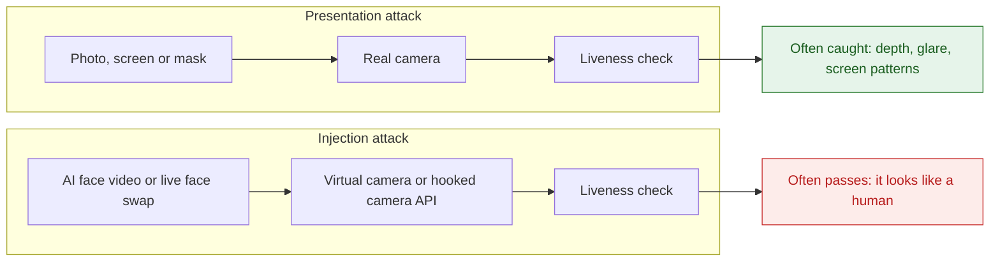

- **Presentation attack:** something fake is held in front of a real camera.
- **Injection attack:** the camera is skipped and a synthetic video is pushed into the app. It can blink and smile on command, so it **passes normal liveness checks**.
- **Hard limits:** only a **short clip**, and **no earlier video** of the real person.

---

## 3. Whole system at a glance

Two devices join a call. The agent laptop runs the UI, the backend and an optional small local language model.

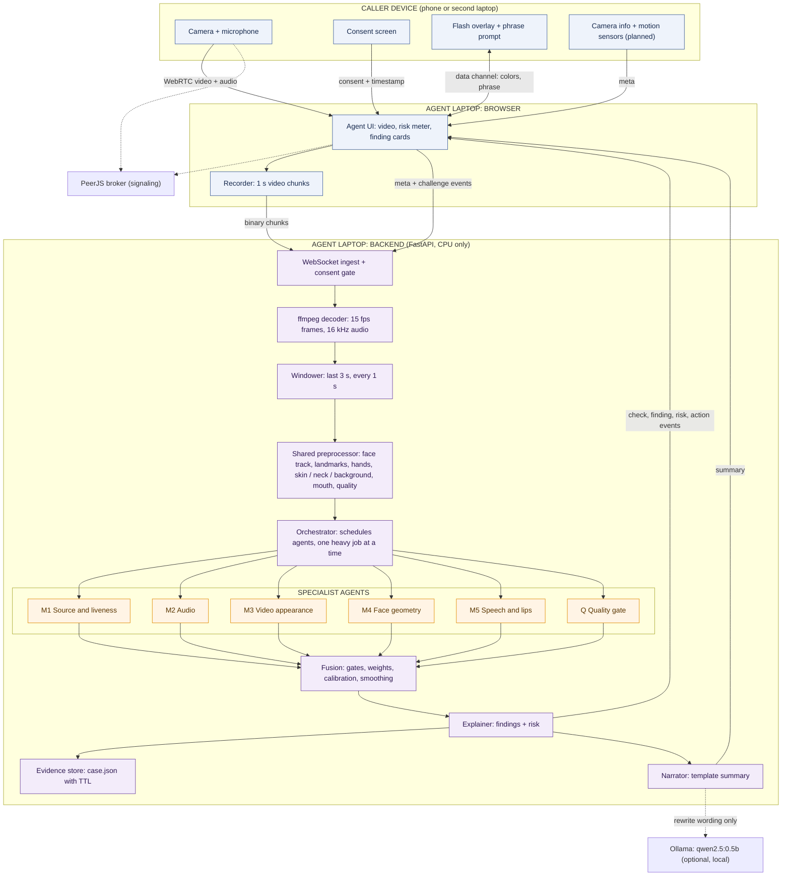

**Tap point:** by default the agent's browser records the **received** stream and sends it to the backend (`TAP=agent`). `TAP=caller` lets the caller page send its own camera instead, which gives a cleaner signal (no WebRTC re-compression, real camera info, correct flash timing).

---

## 4. The multi-agent team

Each agent owns **one modality and answers one question**. Agents never read each other's output. Only the fusion layer sees all of them.

| Agent | Modality | The one question it answers | Current state |
|---|---|---|---|
| **M1 Source and liveness** | Metadata, network stats, sensors, screen light | Is this stream coming from a live camera in front of this screen? | Rules and light check working, incomplete |
| **M2 Audio** | Waveform | Is this voice natural, or synthetic or cloned? | Stub |
| **M3 Video appearance** | Face pixels over time | Do the pixels look like a real capture, or a generated or blended face? | Stub |
| **M4 Face geometry** | Landmarks, pose, motion | Does the face move like a real head? | Jitter and occlusion partly working |
| **M5 Speech and lips** | Audio and mouth together | Do the sound and the lips say the same thing? | Code written, Whisper not wired |
| **Q Quality gate** | All streams | How much should the other agents be trusted right now? | Working |
| **F Fusion** | Agent outputs | What is the calibrated risk, and which reasons explain it? | Working, hand-set weights |
| **E Explainer and narrator** | Findings | How do we say it in plain English? | Working (template, optional LLM) |

### What each agent looks at

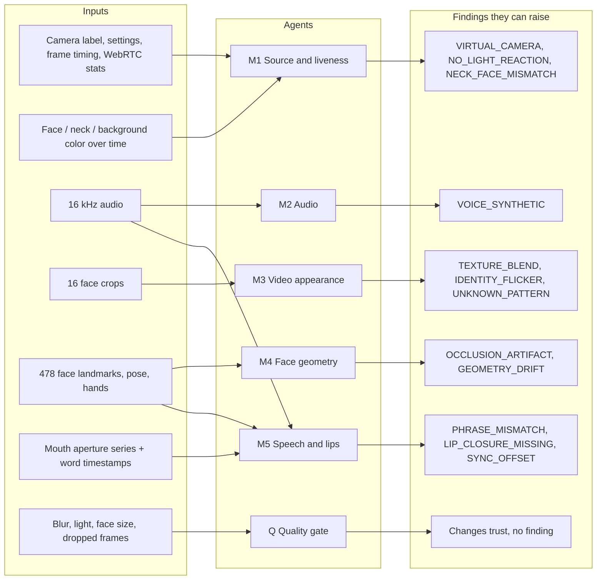

### The contract every agent follows

```python
@dataclass
class ModuleResult:
    module_id: str          # "M1_source", "M2_audio", ...
    status: str             # "ok" | "skipped" | "degraded" | "error"
    risk: float             # 0 = looks genuine, 1 = looks fake
    confidence: float       # 0..1, how much to trust this result right now
    features: dict          # named values used by fusion and explanations
    findings: list          # plain-English reasons with severity
    implementation: str     # "trained" | "heuristic" | "stub"
    model_version: str
    latency_ms: float
```

Rules:

- A missing input (no audio, no face, no phrase yet) gives `status="skipped"` and `confidence=0`. It is **never** treated as "fake".
- A stub reports `implementation="stub"`, gets weight 0 in fusion, and shows as "not available" in the UI.

---

## 5. How the agents work together

The orchestrator runs agents on three schedules so the laptop never overloads.

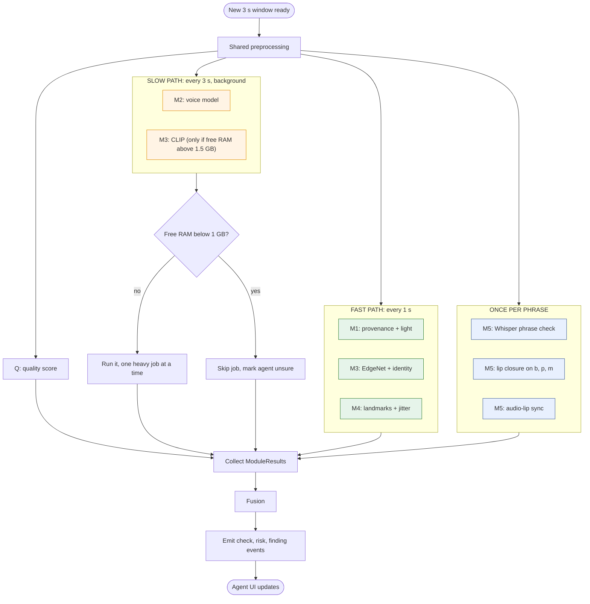

**Operating rules**

- **Latest wins.** If processing falls behind, old windows are dropped. There is no endless queue.
- **Missing data is allowed.** No audio means voice and lips show "unsure" and weight moves to other agents.
- **One heavy job at a time** on the 8 GB laptop.

### Sliding windows

```mermaid
gantt
  title Sliding 3-second windows, one result per second
  dateFormat HH:mm:ss
  axisFormat %S s
  section Video stream
  Incoming video            :00:00:00, 8s
  section Windows
  Window 1 (0 to 3 s)       :00:00:00, 3s
  Window 2 (1 to 4 s)       :00:00:01, 3s
  Window 3 (2 to 5 s)       :00:00:02, 3s
  Window 4 (3 to 6 s)       :00:00:03, 3s
  Window 5 (4 to 7 s)       :00:00:04, 3s
```

---

## 6. Live call, step by step

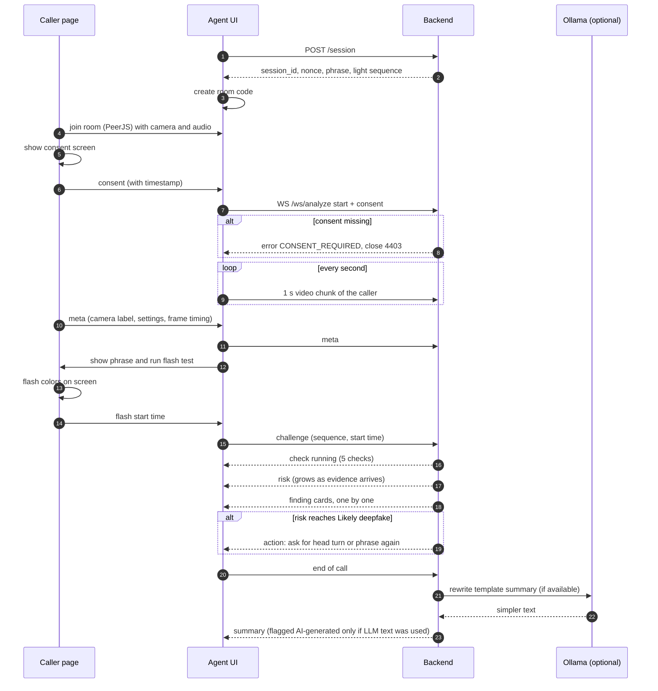

---

## 7. The light challenge

The strongest cheap signal. The caller's screen shows a **random color sequence** built from an HMAC of the session nonce. A real face reflects a little of that light **right now**. A pre-made fake cannot know the colors.

```mermaid
flowchart LR
  SEC["Server secret + session nonce"] --> HM["HMAC"]
  HM --> SEQ["Random color sequence"]
  SEQ --> SCR["Caller screen: white sync pulse, then soft colors (max 3 changes per second)"]
  SCR --> FACE["Real face reflects the light"]
  FACE --> VID["Video seen by backend"]
  VID --> EXT["Extract color over time: face, neck, background"]
  EXT --> CMP["Compare with expected sequence"]
  CMP --> F1["corr_face"]
  CMP --> F2["neck_face_corr + neck_face_ratio"]
  CMP --> F3["snr"]
  F1 & F2 & F3 --> SC["Light score + confidence"]
  SC --> OUT{"Result"}
  OUT -->|"face follows colors"| GOOD["Looks live"]
  OUT -->|"no reaction"| BAD["NO_LIGHT_REACTION"]
  OUT -->|"face and neck differ"| MID["NECK_FACE_MISMATCH"]

  classDef good fill:#e6f4ea,stroke:#2e7d32;
  classDef bad fill:#fdecea,stroke:#c62828;
  classDef mid fill:#fff4e5,stroke:#e08a00;
  class GOOD good;
  class BAD bad;
  class MID mid;
```

| Feature | Meaning | Why it helps |
|---|---|---|
| `corr_face` | How well face color follows the sequence | Pre-made fakes do not follow it |
| `neck_face_corr`, `neck_face_ratio` | Do face and neck react the same way? | In a face swap, the fake face and real neck can react differently |
| `snr` | Signal strength | Low light lowers trust in this check |
| `lag_ms` | Delay of the reaction | **Not used as evidence with `TAP=agent`**, since network delay changes it |

**Safety:** at most 3 color changes per second, soft colors, a warning screen and a Skip button (photosensitivity).

**Honest limit:** a fast attacker who re-lights the fake in real time can weaken this check. That is why other agents exist.

**Known gap:** the code detects the white sync pulse but does not yet shift the target series to line up with it, and it uses only the red channel. Fixing both is planned.

---

## 8. Fusion and decision

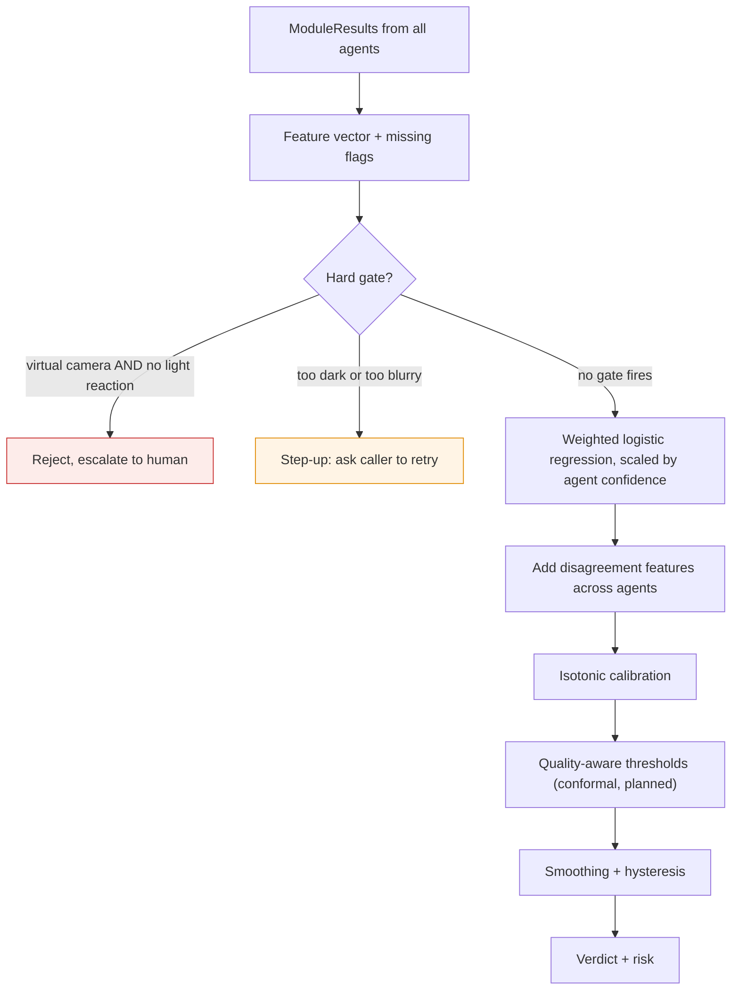

**Verdict bands**

| Risk | Verdict |
|---|---|
| below 0.40 | **Looks real** |
| 0.40 to 0.70 | **Needs a closer look** |
| 0.70 or more | **Likely a deepfake** |

(The earlier design used 0.35 as the lower edge. The code uses 0.40. Pick one and keep code and docs the same.)

**Hysteresis** stops the badge from flickering:

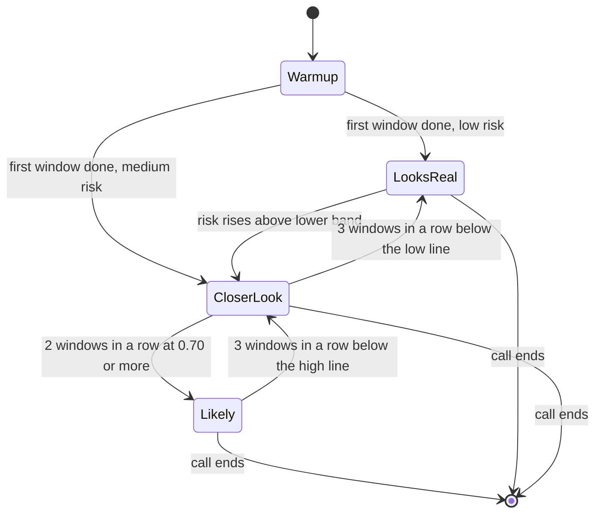

Numbers are starting values and must be tuned on real recordings.

**Training the fusion**

- Missing channels are handled with **modality dropout**: whole agents are randomly removed during training so fusion works with any subset.
- Composite sessions (scores sampled independently per channel) can be used for **fitting**. **Validation and calibration use real recorded sessions only.**
- Weights today are hand-set and labeled `stub`.

**On "Likely a deepfake":** the UI shows a red banner and an **action card** (for example, "Ask the caller to turn their head left, then say the phrase again"). **The call is never ended automatically.**

---

## 9. Explanations

TrustLens must say **why**, and each explanation is labeled by how far it can be trusted.

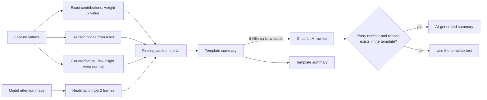

| Explanation | Trust level |
|---|---|
| Exact contributions, counterfactuals, reason codes, light and audio charts | **Faithful** (computed from real features) |
| Heatmaps (Grad-CAM or attention) | **Illustrative** (where the model looked, not proof) |
| LLM summary | **Wording only.** It can never change a score or decision |

### Finding cards

| Code | Agent | Title shown to the human agent | Severity |
|---|---|---|---|
| `VIRTUAL_CAMERA` | M1 | Video may not come from a real camera | high |
| `NO_LIGHT_REACTION` | M1 | Face did not react to screen light | high |
| `NECK_FACE_MISMATCH` | M1 | Face and neck react differently to light | medium |
| `TEXTURE_BLEND` | M3 | Face edges or skin look artificial | medium or high |
| `IDENTITY_FLICKER` | M3, M4 | Face identity changes between frames | medium |
| `OCCLUSION_ARTIFACT` | M4 | Face breaks when covered | medium |
| `VOICE_SYNTHETIC` | M2 | Voice may be computer-made | medium |
| `LIP_CLOSURE_MISSING` | M5 | Mouth does not match the sound | medium |
| `SYNC_OFFSET` | M5 | Sound and lips are out of step | medium |
| `PHRASE_MISMATCH` | M5 | They did not say the requested words | high |
| `UNKNOWN_PATTERN` | M3 | Unusual video that we cannot judge | low |

---

## 10. Algorithms used

| Area | Algorithm | What it does in plain words | State |
|---|---|---|---|
| Decoding | ffmpeg (2 persistent processes) | Turns streamed chunks into frames and audio | Working |
| Windowing | Sliding 3 s window, 1 s stride | One fresh result per second | Working |
| Face tracking | MediaPipe landmarks (478 points) | Finds the face, mouth, skin and neck | Working |
| Challenge | HMAC of session nonce | Makes colors nobody can predict | Working |
| Light check | Correlation, chromaticity, SNR | Does the face follow the flash? | Working, incomplete |
| Face vs neck | Compare the two light responses | Spots swapped faces on real necks | Working |
| Provenance | Rule-based flags + frame-timing statistics | Spots virtual cameras and injected streams | Working |
| Face texture | EdgeNet: MobileNetV3-Small + FFT branch + GRU | Spots artificial texture and flicker | Stub |
| Blend traces | CLIP ViT-B/32, LayerNorm-only tuning, self-blended images | Spots seams left by face swaps | Stub |
| Identity | Embedding cosine similarity across frames | Is it the same face frame to frame? | Placeholder |
| Landmark jitter | Second differences of landmark tracks | Is the motion smooth like a real face? | Working |
| Voice | Frozen WavLM + small head | Is the voice cloned? | Stub |
| Phrase | Whisper tiny with word times, word error rate | Did they say the random words? | Not wired |
| Lip closure | Mouth aperture at b, p, m onsets | Do the lips close when they must? | Written |
| Sync | Audio-energy vs mouth-aperture cross-correlation | Do sound and lips line up? | Written |
| Pulse (rPPG) | Skin color pulse | Information only, weight 0 | Optional |
| Fusion | Regularized logistic regression + modality dropout | Weighted scorecard | Hand-set |
| Calibration | Isotonic regression | Makes "0.8" mean about 80% | Hand-set |
| Thresholds | Conformal prediction | Caps real-user rejection near 2% | Planned |
| Stability | EMA smoothing + hysteresis | Stops badge flicker | Working |
| Explanations | Weight x value, counterfactuals, Grad-CAM | Honest reasons | Working / planned |
| Deployment | ONNX + int8 quantization | Small, fast models on CPU | Planned |

**Why "b, p, m"?** These sounds force the lips to close. Generated mouths often stay slightly open. The random phrase uses words that start with them ("Paper", "Mountain", "Bottle").

**Why self-blended images (SBI)?** Fake training data is scarce, so fakes are made from real faces: slightly alter a copy (color, blur, size) and blend it back with a mask. The model learns the **seam** that many different face-swap tools leave, not one tool's fingerprint.

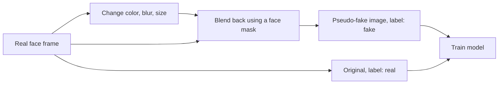

---

## 11. Running on a CPU-only 8 GB laptop

| Item | Rule | Rough RAM (estimate, measure it) |
|---|---|---|
| OS + Chrome with a live call | Leave free | 3.0 to 3.5 GB |
| EdgeNet int8 | Always loaded | under 0.1 GB |
| MediaPipe | Always loaded | about 0.2 GB |
| WavLM head int8 | Run every 3 s | 0.2 to 0.5 GB |
| Whisper tiny int8 | Load when needed, unload after | about 0.15 GB |
| CLIP ViT-B/32 int8 | **Off by default.** Only if free RAM is above 1.5 GB | 0.2 to 0.4 GB |
| ffmpeg (2 processes) | Per session | about 0.2 GB |
| Ollama `qwen2.5:0.5b` | Only after the call ends, `keep_alive` 5 minutes | 0.5 to 0.8 GB |

**Targets (measure and report, do not assume):** first check update within 1 s, first finding within 5 s, fast path per window p95 within 1.5 s on CPU.

---

## 12. API

### WebSocket `/ws/analyze`

| Direction | Message | Purpose |
|---|---|---|
| Client to server | `start` with `consent` and optional `session_id` | Open a session. Rejected without consent |
| Client to server | Binary chunks, 1 s each, `video/webm` | Caller video and audio |
| Client to server | `meta` | Camera label, settings, frame intervals |
| Client to server | `challenge` | Light sequence and start time, expected phrase |
| Client to server | `clock` | Clock offset estimate |
| Server to client | `check` `{id, state}` | `id`: source, light, face, voice, lips. `state`: running, ok, warn, bad |
| Server to client | `finding` `{id, severity, title, detail, t}` | A reason card |
| Server to client | `risk` `{value}` | 0 to 1 |
| Server to client | `action` `{kind, message, challenge}` | Suggested next step |
| Server to client | `summary` `{text, ai_generated}` | End-of-call summary |
| Server to client | `evidence` `{kind, url, data}` | Heatmap or timeline |
| Server to client | `error` `{code}` | For example `CONSENT_REQUIRED` |

### REST

| Method | Path | Purpose |
|---|---|---|
| POST | `/session` | New session: nonce, phrase, light sequence, expiry |
| POST | `/analyze/file` | Upload a video (max 50 MB), same pipeline as live |
| GET | `/cases/{session_id}` | Saved evidence JSON (if retention is on) |
| GET | `/health` | Models loaded, ffmpeg present, `stubs_in_use` |
| GET | `/metrics` | Latency per stage, dropped windows, RAM |

---

## 13. Quick start

### Frontend (works with the built-in mock engine)

```bash
npm install
cp .env.example .env     # VITE_USE_MOCK=true
npm run dev
```

Open the URL Vite prints, allow camera and microphone, choose a scenario, and start the call. After a few seconds the reasons appear on the right.

### Backend

```bash
cd backend
python -m venv .venv && source .venv/bin/activate
pip install -r requirements.txt     # ffmpeg must be installed on the system
python -m pytest tests -q           # 62 tests
uvicorn app.main:app --host 0.0.0.0 --port 8000
```

Then set `VITE_USE_MOCK=false`, `VITE_API_URL=http://localhost:8000` and `VITE_WS_URL=ws://localhost:8000` in `.env`.

### Optional local summary model

```bash
ollama pull qwen2.5:0.5b
ollama list
```

### Two-device call

- Put both devices on the same Wi-Fi or a phone hotspot.
- The caller phone needs **HTTPS** for the camera. Use a tunnel (Cloudflare Tunnel, ngrok) or mkcert.
- PeerJS uses the public broker by default. Backup: `npx peerjs --port 9000` and point both devices to the laptop IP.
- Keep a **clip backup** ready in case the network fails.

### Configuration

| Variable | Default | Meaning |
|---|---|---|
| `ALLOWED_ORIGINS` | `http://localhost:5173` | CORS and origin check |
| `SECRET_KEY` | none | Used for the light-sequence HMAC |
| `USE_MOCK` | `false` | Scripted events, no AI |
| `CLIP_MODE` | `false` | Expect complete 3 s clips |
| `TAP` | `agent` | Where video comes from (`agent` or `caller`) |
| `FPS` / `WINDOW_SEC` / `STRIDE_SEC` | 15 / 3 / 1 | Windowing |
| `MEMORY_PROFILE` | `8gb` | Model loading rules |
| `NARRATOR_MODE` | `auto` | `auto`, `template`, `llm` |
| `OLLAMA_URL` / `OLLAMA_MODEL` | `http://localhost:11434` / `qwen2.5:0.5b` | Local LLM |
| `KEEP_RAW` | `false` | Store raw media (keep off) |
| `CASE_TTL_HOURS` | `24` | Delete saved cases after this |
| `ENV` / `DEMO_BYPASS_CONSENT` | `prod` / `false` | Consent bypass only in demo |

---

## 14. Repository layout

```text
repo/
├── src/                         # Frontend: Vite + React + Tailwind
│   ├── App.jsx  Lobby.jsx  Call.jsx  Panel.jsx
│   ├── api.js                   # config, mock engine, backend client
│   └── FlashOverlay / caller page / PeerJS helpers
├── backend/
│   ├── app/
│   │   ├── main.py  config.py  schemas.py  session.py  ws.py
│   │   ├── decoder.py  windower.py  preprocess.py  runtime.py  pipeline.py
│   │   ├── fusion.py  explain.py  narrator.py  store.py  metrics.py
│   │   ├── modules/             # target: m1_source ... m5_speech_lips, quality
│   │   └── signals/             # provenance, light, identity, quality,
│   │                            # phrase, lip_closure, sync, rppg
│   ├── models/                  # registry.json, fusion.json, MODEL_CARD.md (no .onnx yet)
│   └── tests/                   # 62 tests
├── ml/                          # training scripts 01 to 06 (Kaggle / Colab), not yet run
├── bench/                       # replay harness and fixtures
├── docker-compose.yml
└── README.md
```

---

## 15. Evaluation plan

Modeled on the **CEN/TS 18099** idea: test **attacks** and also **real users** (false rejection).

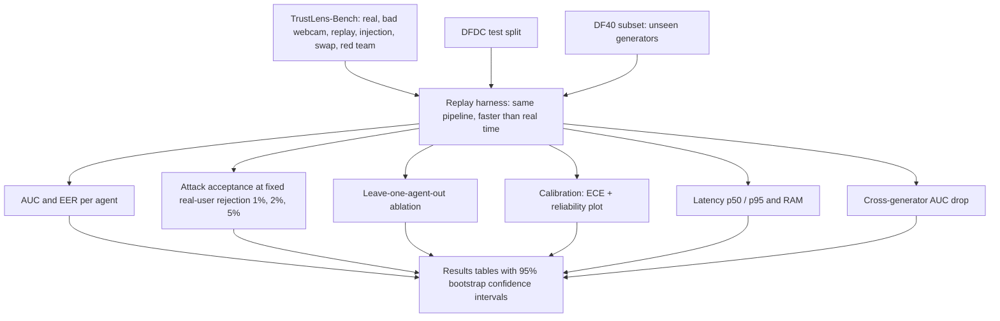

| Test | What it proves |
|---|---|
| Per-agent AUC / EER on 3 s windows | Each agent works alone on short clips |
| Compression sweep (clean, medium, heavy) | Works on real webcams |
| Cross-generator (train DFDC + SBI, test DF40) | Generalizes to unseen fake types |
| Attack acceptance by level L0 to L4 | The main security number |
| Real-user rejection, good vs bad webcam, by skin tone, age, glasses, light | Fair to real users |
| Leave-one-agent-out ablation | Every agent matters |
| Missing-agent test | Sensible verdicts with no audio, no phrase, no flash |
| Calibration (ECE) | Scores can be trusted |
| Latency and RAM | Fits a CPU laptop |

**Rules:** split by source video, degrade both real and fake data, never tune on the test set, and never report accuracy while any contributing agent is a stub. Synthetic clips check plumbing only and are labeled `source=synthetic`.

---

## 16. Threat model

| Level | Attacker | Example | Defense | Honest rating |
|---|---|---|---|---|
| L0 | Presentation | Photo or screen in front of the camera | Light check, quality, phrase | Strong |
| L1 | Cheap injection | Pre-recorded deepfake via virtual camera | Light check, phrase, camera flags | Strong |
| L2 | Real-time swap | Live person + face-swap tool | Neck-vs-face light, identity, geometry, lips, models | Medium to strong (test it) |
| L3 | L2 + voice | Voice conversion or TTS | Voice model, phrase, lip closure | Medium |
| L4 | Adaptive | Attacker re-lights the fake to match the flash | Layered random challenges | Raises cost, not guaranteed |
| L5 | Device compromise | Hooked camera API, emulator, rooted phone | **Needs native device attestation** | **Not solved in a web demo** |

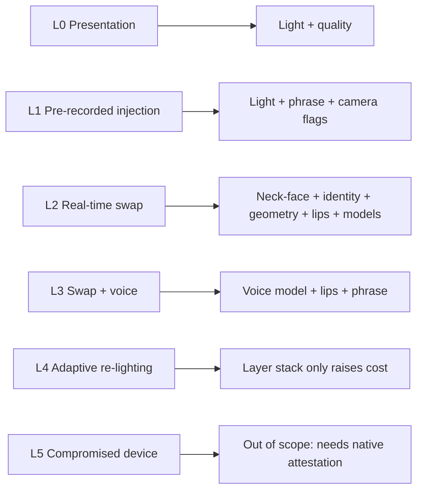

---

## 17. Privacy and consent

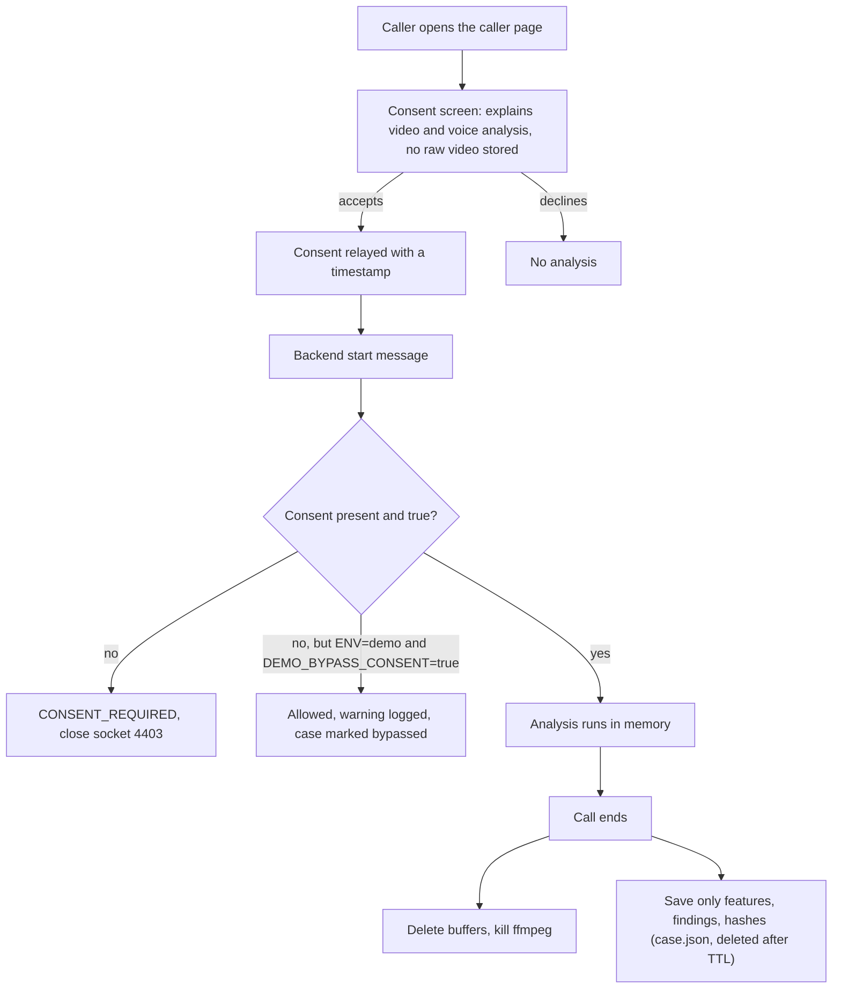

- **Consent comes from the caller**, the person being analyzed.
- **No raw video or audio is stored by default** (`KEEP_RAW=false`). Do not commit saved cases or heatmaps of real people to the repository.
- **The summary model runs locally** (Ollama). No evidence is sent to an outside API.
- Test for **bias** across skin tones, ages, glasses, lighting and webcams, and report even a small check.
- Check local rules for video KYC (for example RBI V-CIP in India, FinCEN and BSA in the US, GDPR in the EU). **Verify exact clauses before stating them.**

---

## 18. Limitations (honest)

- **Trained models are not available yet.** Face-texture and voice agents are stubs, so no detection accuracy is claimed. The system was not trained on the full provided dataset because of compute and time limits, and that dataset has no light-flash or spoken-phrase signals. Mitigation: a small subset, frozen pretrained backbones, self-blended fakes, degradation of both classes, and our own consented recordings.
- **Compromised devices (L5)** are not solved in a browser. Real products need native attestation (Play Integrity / App Attest) and a secure SDK.
- A **fast adaptive attacker** who re-lights the fake in real time can weaken the light check.
- **New fake generators** can still fool the models. The drop on unseen generators is measured and reported.
- With the **agent-side tap**, video is re-compressed and delayed, so camera clues are weaker and absolute light timing is not used. `TAP=caller` is better.
- **3 seconds is short.** Pulse (rPPG) is information only.
- The **demo benchmark will be small**, so confidence intervals will be wide.
- The **small summary model can make mistakes**, so it only rewrites a fixed template and its output is checked.
- **Photosensitivity:** flashing is limited and skippable, and some users should not use it.
- RAM numbers in this file are **estimates**. Measure them.

---

## 19. Glossary

| Term | Simple meaning |
|---|---|
| **KYC** | Know Your Customer: checking who a new customer really is |
| **Liveness** | Checking a real, present person is on camera |
| **Presentation attack** | Showing a fake (photo, screen, mask) to a real camera |
| **Injection attack** | Feeding fake video straight into the app, skipping the camera |
| **Virtual camera** | Software that pretends to be a webcam (for example OBS) |
| **Face swap** | AI puts one person's face on another's moving head |
| **Agent (module)** | A small specialist that checks one modality and returns a standard result |
| **Orchestrator** | The scheduler that decides which agent runs when |
| **Fusion** | Combining all agent results into one calibrated risk |
| **HMAC** | A keyed hash used here to make unpredictable flash colors |
| **SBI** | Self-Blended Images: fake training examples made from real faces |
| **CLIP / WavLM** | Large pretrained vision / speech models, tuned lightly here |
| **ONNX / int8** | Portable model file / smaller, faster number format |
| **WebRTC / PeerJS** | Browser live-video technology / a library that makes it easy |
| **EER / AUC** | Error rate where false accept equals false reject / ranking quality |
| **ECE** | How well predicted risk matches real frequency |
| **Conformal** | A method to set thresholds with a target error rate |
| **Hysteresis** | Needing several windows in a row to change the verdict |
| **rPPG** | Pulse estimated from tiny skin color changes |
| **CEN/TS 18099** | A standard for testing injection-attack detection |